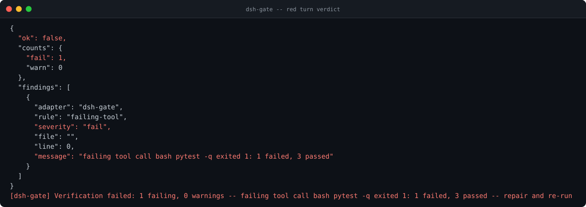
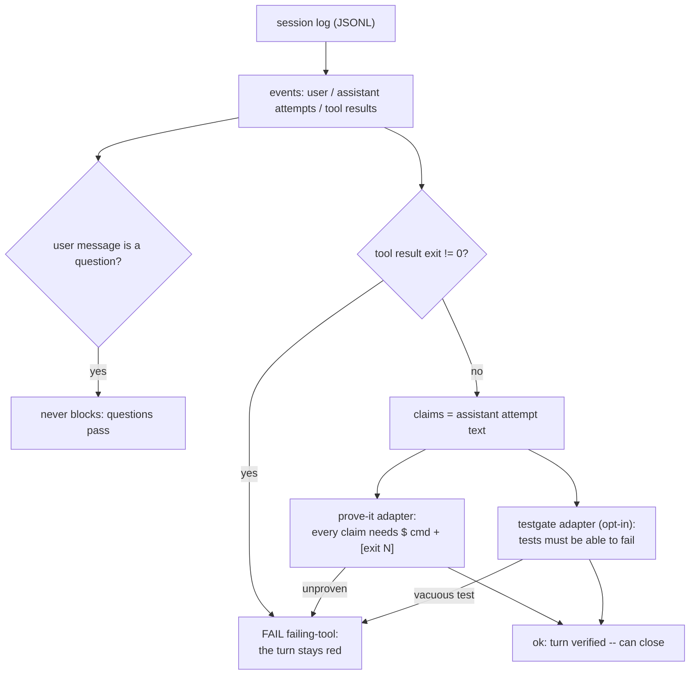

# dsh-gate

**Deterministic turn gate for DeepSeek Harness.** Claims need evidence, tests must be able to fail, red tool calls block the turn - and a question to the user never blocks anything. Reads the session log (JSONL), runs the sibling gates over the finished turn, prints a verdict: JSON for machines, one human line for the terminal. No model, no network, no logprobs - the opposite of an LLM verifier.

[](https://github.com/F0Rextasy/dsh-gate/actions/workflows/test.yml)
[](https://www.python.org/)
[](#what-it-will-never-do)
[](https://skills.sh/F0Rextasy/dsh-gate)
[](LICENSE)



## Why this exists

An agent turn ends with "done - all tests pass." Behind it: `pytest` exited 1, the tool result in the session log says so, and the harness was about to close the turn green anyway. LLM verifiers answer this with another LLM call - same failure surface, new bill. The session log already contains the facts: an attempt's text (claims), tool results with exit codes (reality), user messages (questions). `dsh-gate` reads those facts and applies rules - deterministically, in milliseconds, offline.

## Quick start

```bash
# install the skill into any agent (Claude Code, Codex, Cursor, OpenCode, ...):
npx skills add F0Rextasy/dsh-gate

# or run it directly:
git clone https://github.com/F0Rextasy/dsh-gate
python dsh-gate/scripts/dsh-gate session --log session.jsonl   # verdict JSON
python dsh-gate/scripts/dsh-gate message --log session.jsonl   # + gate text on stderr
```

| Exit | Meaning |
| --- | --- |
| `0` | turn verified: no blocking finding |
| `1` | verdict fails: unproven claim, failing tool call, vacuous test |
| `2` | usage error (missing/unreadable log) |

## How it decides



Adapters: prove-it runs **on by default** (`--no-prove` to skip, `--prove-script` to point elsewhere); testgate is opt-in (`--testgate`). Missing adapter script degrades to a recorded warning, never a silent pass. Full rules: [references/RULES.md](references/RULES.md).

## Evidence (real output)

A session where the assistant claimed success, but `pytest` exited 1:

```console
$ python scripts/dsh-gate message --log session.jsonl --no-prove
{
  "ok": false,
  "counts": {
    "fail": 1,
    "warn": 0
  },
  "findings": [
    {
      "adapter": "dsh-gate",
      "rule": "failing-tool",
      "severity": "fail",
      "file": "",
      "line": 0,
      "message": "failing tool call bash pytest -q exited 1: 1 failed, 3 passed"
    }
  ]
}
[dsh-gate] Verification failed: 1 failing, 0 warnings -- failing tool call bash pytest -q exited 1: 1 failed, 3 passed -- repair and re-run
[exit 1]
```

With `--prove` the verdict additionally cites every unproven claim - file, line, and the missing evidence block. Contract tests drive the real adapter against fake session logs, no harness needed:

```console
$ python -m unittest discover -s tests -v
test_failing_tool_blocks (test_dsh_gate.DshGateContract) ... ok
test_message_command_posts_to_stderr (test_dsh_gate.DshGateContract) ... ok
test_missing_log_is_usage_error (test_dsh_gate.DshGateContract) ... ok
test_proven_claims_pass_with_exit_zero (test_dsh_gate.DshGateContract) ... ok
test_questions_never_block (test_dsh_gate.DshGateContract) ... ok
test_testgate_collects_pytest_findings (test_dsh_gate.DshGateContract) ... ok
test_unproven_claim_blocks_with_exit_one (test_dsh_gate.DshGateContract) ... ok
test_verdict_json_reports_structure (test_dsh_gate.DshGateContract) ... ok

----------------------------------------------------------------------
Ran 8 tests in 1.446s

OK
[exit 0]
```

Covered: proven-pass, red-tool block, question-never-blocks, unproven-claim, adapter findings, verdict JSON shape, missing log.

## Wire it in

As the close-turn check in the harness (post-turn hook), or in CI over a dumped session:

```bash
dsh-gate message --log "$SESSION" --path . --testgate || echo "turn stays open"
```

`--path` is the workspace the testgate adapter scans; verdict JSON goes to stdout, the human gate line to stderr.

## What it will never do

- Call a model to decide whether the turn is done - the log's exit codes are the ground truth.
- Block a question: anything shaped like a user-facing question passes by design.
- Pass silently when an adapter is missing: that is a recorded warning, visible in the verdict.

## The family

Deterministic gates - one Python script each, stdlib, same exit contract:

| Gate | Catches |
| --- | --- |
| [preflight](https://github.com/F0Rextasy/preflight) | committed `.env`, weak secrets, debug-in-prod, wildcard CORS |
| [bandaid](https://github.com/F0Rextasy/bandaid) | symptom-suppression patches: swallowed errors, disabled tests, removed guards |
| [prove-it](https://github.com/F0Rextasy/prove-it) | claims with no executed evidence behind them |
| [testgate](https://github.com/F0Rextasy/testgate) | tests that can never fail |
| [shipcheck](https://github.com/F0Rextasy/shipcheck) | broken, unimportable, or stale release artifacts |
| **dsh-gate** (this repo) | red turns closing green in DeepSeek Harness |
| [ci-triage](https://github.com/F0Rextasy/ci-triage) | red CI triaged without an LLM |
| [docproof](https://github.com/F0Rextasy/docproof) | documentation snippets that no longer parse or run |

## License

[MIT](LICENSE)
